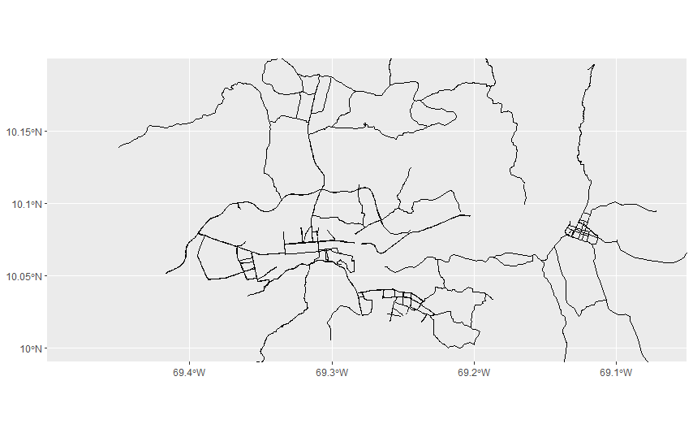

# Streetmap-with-ggplo2
Here show you how make a street map  you city 
---
title: "Streetmaps with ggplot2"
author: "Ivan Leonel Vasquez R."
date: "December 7, 2019"
output:
  html_document: default
  pdf_document: default
  word_document: default
---

```{r setup, include=FALSE}
knitr::opts_chunk$set(echo = TRUE)

```

## Map Barquisimeto-Cabudare, Venezuela.

Here i show you how following step by step the tutorial instruction give in <http://ggplot2tutor.com/streetmaps/streetmaps/>, we can will generate code in R (ggplot2) which output are streets maps of our city.

Aquí te muestro cómo siguiendo paso a paso las instrucciones del tutorial<http://ggplot2tutor.com/streetmaps/streetmaps/>, podemos generar código en R (ggplot2) cuyo resultado son mapas de calles de nuestra ciudad.

This work was made for the City Barquisimeto-Cabudare, the city where I currently live in the Venezuela country.

we needs to instal ***omsdata*** and ***ggplot2*** packages, ggplot2 is in **tidyverse**, so is enough instal it.


```{r cars, include=TRUE}

library(tidyverse)
library(tinytex)

```

 We will use the package ___osmdata___ to extract the streets from the _Openstreetmap_ database. Openstreetmap is a freely available database of all locations in the world under an open license. Next we will use the funtion **getbb()** to determiner the coordenade longitude and latitude.
 
You can to adjust the longitude and latitude of your preferred city, just change the location in the function ***getbb()***.

```{r rune, include=TRUE}

library(osmdata)
getbb("Cabudare im Venezuela")
streets <- getbb("cabudare Venezuela")%>%
  opq()%>%
  add_osm_feature(key = "highway", 
                  value = c("motorway", "primary", 
                            "secondary", "tertiary")) %>%
  osmdata_sf()
streets

small_streets <- getbb("Cabudare im Venezuela")%>%
  opq()%>%
  add_osm_feature(key = "highway", 
                  value = c("residential", "living_street",
                            "unclassified",
                            "service", "footway")) %>%
  osmdata_sf()

river <- getbb("Cabudare im Venezuela")%>%
  opq()%>%
  add_osm_feature(key = "waterway", value = "river") %>%
  osmdata_sf()
```

## Plot 1

We´ll star  with a plot basic, which to show you the principals streets  our city


```{r pressure, echo=TRUE}
ggplot() +
  geom_sf(data = streets$osm_lines,
          inherit.aes = FALSE,
          color = "black",
          size = .4,
          alpha = .8) +
  coord_sf(xlim = c(-69.50, -69.05), 
           ylim = c(9.99, 10.20),
           expand = FALSE)
```
```


```
## Plot 2

This plot conteins add  features as details with a bit precision. there are more avalaibles features can be useful,To get all tags of a feature via osmdata, you can enter the following function ***available_tags()*** or if you want more details visit <http://ggplot2tutor.com/streetmaps/streetmaps/>.
```{r pressure2, echo=TRUE}
ggplot() +
  geom_sf(data = streets$osm_lines,
          inherit.aes = FALSE,
          color = "steelblue",
          size = .4,
          alpha = .8) +
  geom_sf(data = small_streets$osm_lines,
          inherit.aes = FALSE,
          color = "black",
          size = .4,
          alpha = .6) +
  geom_sf(data = river$osm_lines,
          inherit.aes = FALSE,
          color = "red",
          size = .2,
          alpha = .5) +
  coord_sf(xlim = c(-69.50, -69.05), 
           ylim = c(9.99, 10.20),
           expand = FALSE) 
```

 
Now you can try it and to make the ***streetmap*** of you city. If you need help feel free tell me.

